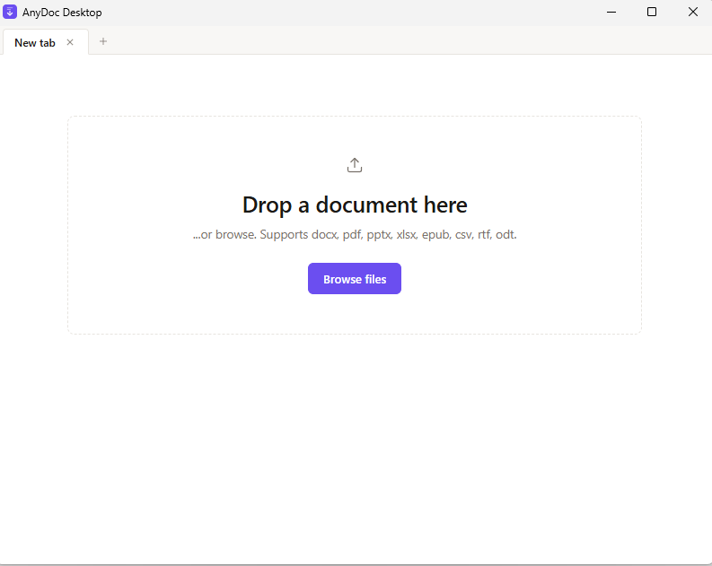

# AnyDoc Desktop

A local, offline desktop app that converts documents to Markdown. Drop a file, get clean Markdown, copy or save it out. Built with Tauri and the `@firecrawl/anydoc-wasm` engine, delivering native performance with zero cloud dependencies.

## Download and Installation
Visit the Releases page
Download the latest version for your platform:

* **Windows**: anydoc-desktop-windows-x64.msi or anydoc-desktop-windows-x64.exe
* **macOS**: anydoc-desktop-macos-universal.dmg or anydoc-desktop-macos-universal.app.tar.gz
* **Linux**: anydoc-desktop-linux-x64.AppImage or anydoc-desktop-linux-x64.deb

Install or run the downloaded file

## Features

* **Local Conversion**: All work happens on-device — no uploads, no accounts, no cloud
* **Wide Format Support**: docx, pdf, pptx, xlsx, epub, csv, rtf, odt
* **Tabbed Workspace**: Open and convert multiple documents side-by-side
* **Preview & Raw Views**: Rendered Markdown or plain source with one-click toggle
* **Copy & Save**: Clipboard copy or native "Save As…" dialog for `.md` output
* **Recent Files**: Reopen previous conversions with a click — persisted via `plugin-store`
* **Keyboard Shortcuts**: Boost your productivity with `Ctrl/⌘+O`, `+T`, `+W`, `+S`

## Minimum Requirements

Windows: 10 (1903+) | macOS: 10.15+ | Linux: Ubuntu 18.04+
RAM: 4 GB (8 GB recommended)
Storage: 200 MB available space

## Development

Rust 1.70+ | Node.js 18+ | Tauri CLI 2+

### Contributing

Contributions are welcome! Please feel free to submit a Pull Request.

## License

This project is licensed under the Apache 2.0 License - see the LICENSE file for details.

## Acknowledgments

* [@firecrawl/anydoc-wasm](https://www.npmjs.com/package/@firecrawl/anydoc-wasm) - The WASM engine that powers this application's document conversion
* [Tauri](https://tauri.app/) - For making it possible to build lightweight, secure desktop applications
